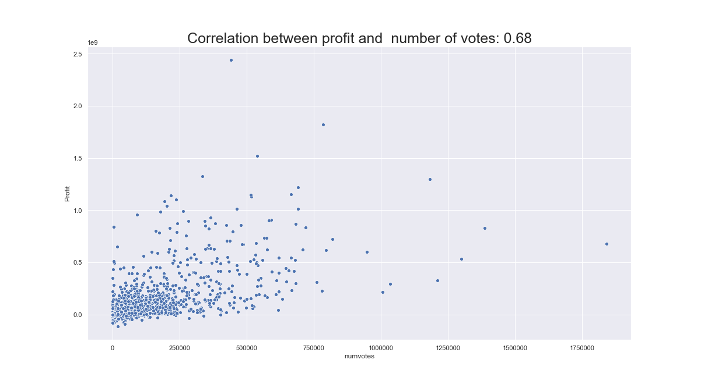
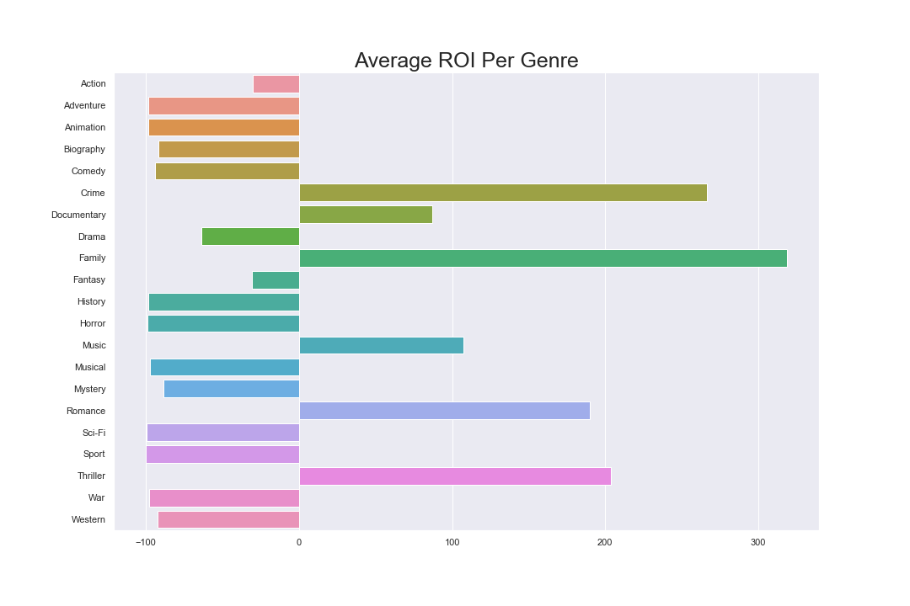
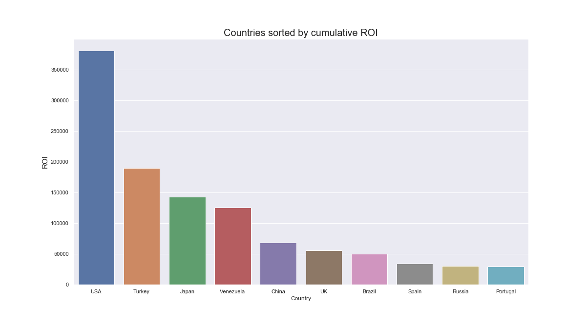

# Microsoft Film Market Analysis

## Overview

This project analyzes the potential opportunities for Microsoft to enter the film business. Descriptive analysis of Box Office information from [the Internet Movie Database](imdb.com).   

## Business Problem

Our team has been put in charge of performing market analysis in order to explore what types of movies are doing the best at the box office and provide insights to Microsoft decision makers who want to make a move into the film space.

## The Data

Our data has been scraped from the Internet Movie Database (IMDb) from the past decade including ratings, online vote counts, budgets, domestic & worldwide gross, and Directors. Any movies that did not record *any* box office figures were discarded.

In the folder [zippedData](./zippedData) are the baseline IMDb databases. Unique name and title id's from these filed were used by the scrapers found in [web_scrapers](./web_scrapers) to compile a more complete dataset which can be found in [scraped_data](./scraped_data) Our cleaned dataset can be found [here](./master_table.csv)

## Methods

This project provides descriptive analysis of over 15,000 movies released in the last decade. It provides insights to stakeholders who are exploring entry into the film industry.

## Results

As a result of our analysis we found that the number of votes/reviews mattered most in relation to profits.

When measuring return-on-investment, we identified six primary genres to focus resources on. When outlier movies were removed from the dataset, these genres displayed the highest ROI.

Lastly, we identified markets outside of the United States that may warrant further study. See "Next Steps" below for more information.  

## Conclusions

Number of reviews can significantly impact profits, put time and energy into producing films that bring in reviews. Our findings indicate this number is more important than the average rating. Similar results have been found in this [study](https://link.springer.com/article/10.1007%2Fs11747-017-0561-6).
ROI highest among movies with:

                      - Crime
                      - Documentary
                      - Family
                      - Music
                      - Romance
                      - Thriller

The vast majority of movie spending takes place within the US, but there are less expensive places to make films and get a significant ROI. Cultural understanding and research into each region should be considered.

## Next Steps

Based on the cumulative ROI figures, additional analysis may yield insights into less competitive markets and more profitable audiences.

### For More Information

To see out full analysis, please refer to our [Jupyter Notebook](microsoft_movie_analysis.ipynb)

For additional info, contact <brendanfrrs@gmail.com> or <david.bruce14@gmail.com>

### Repository Structure
<pre>
├── README.md
├── code
├── david_practice_visualizations.ipynb
├── images
│   ├── Average\ ROI\ Per\ Genre.png
│   ├── Correlation_between_profit_and_numvotes.png
│   ├── Number\ of\ Movies\ per\ Genre.png
│   ├── RE2r0Th.png
│   └── fHBA4cnnUNMz7pet6GVpSe-970-80.png
├── imdb_data_exp.ipynb
├── master_table.csv
├── microsoft_movie_analysis.ipynb
├── movie_data_visualizations.ipynb
├── scraped_data
│   ├── imdb_monetary_data_102849_.csv
│   ├── imdb_monetary_data_16590.csv
│   ├── imdb_monetary_data_16591_to_25214_.csv
│   ├── imdb_monetary_data_29214_.csv
│   ├── imdb_monetary_data_33736_.csv
│   ├── imdb_monetary_data_49857_.csv
│   ├── imdb_monetary_data_65930_.csv
│   ├── imdb_monetary_data_67456_.csv
│   ├── imdb_monetary_data_77436_.csv
│   ├── imdb_name_list_13173_.csv
│   ├── imdb_name_list_202_.csv
│   ├── imdb_name_list_2268_.csv
│   ├── imdb_name_list_3016_.csv
│   ├── imdb_name_list_304_.csv
│   ├── imdb_name_list_7799_.csv
│   └── list_of_directors.csv
├── scripts.py
├── web_scrapers
│   ├── financial_data_scraper_imdb.ipynb
│   └── name_scraper_imdb.ipynb
└── zippedData
    ├── imdb.name.basics.csv.gz
    ├── imdb.title.akas.csv.gz
    ├── imdb.title.basics.csv.gz
    ├── imdb.title.crew.csv.gz
    ├── imdb.title.principals.csv.gz
    └── imdb.title.ratings.csv.gz <pre>
